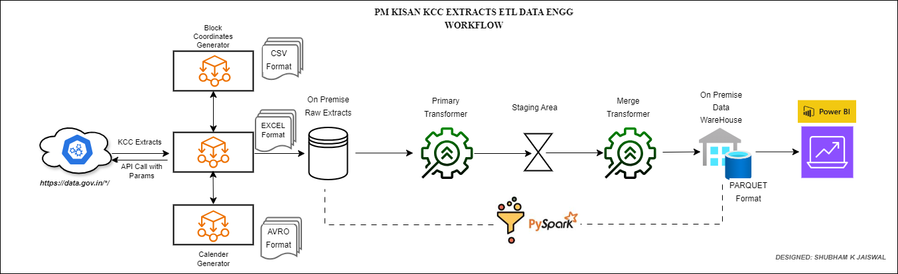
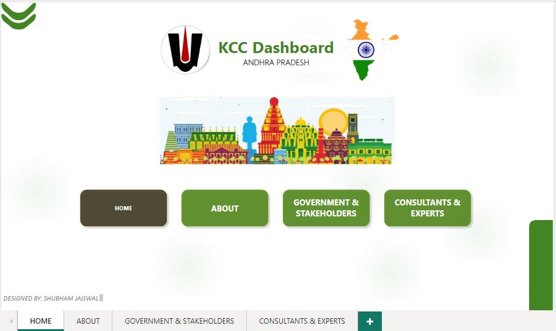
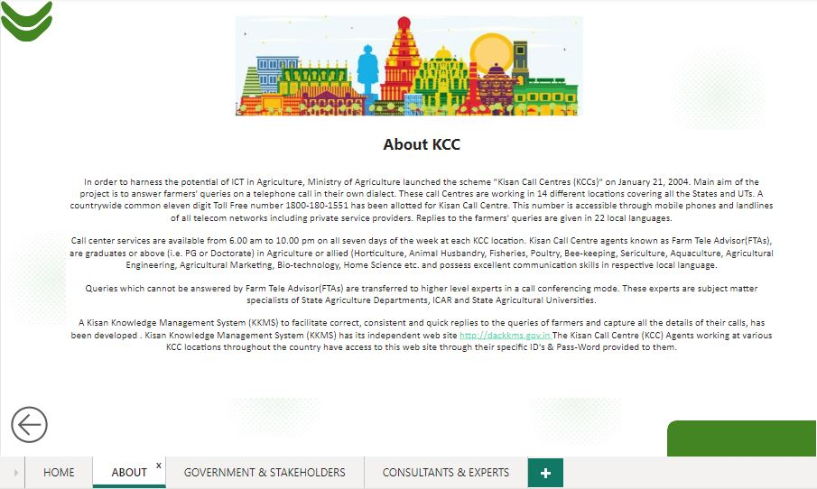
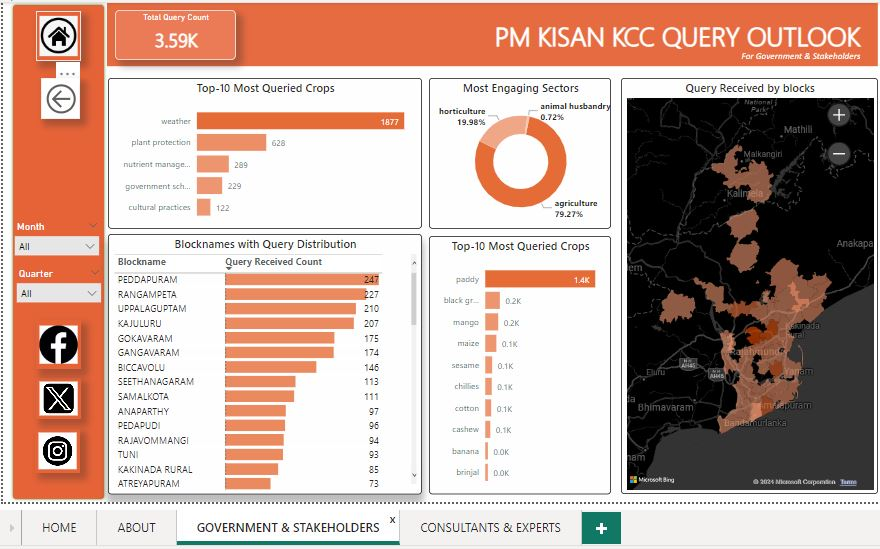
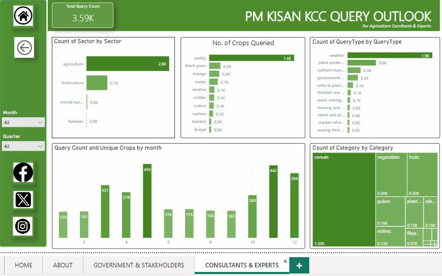

# End To End: PM Kisan KCC🌿 Semi-Automated PySpark Data Pipeline 🔗

## Business/Client Hypothetical Case Study:

Imagine a Case of PM Kisan KCC Department, which has facility of call/sms support portal to resolve issues of Kisan Customers who can raise their query by both means of communication.
In order to submit a query some data is collected like Blockname,Query Type,Category, Crop Type, Question, Response etc with following of privacy guidelines.

- Now all this data is available through a API where data gets updated monthwise managed by Web Application Backend Team. 

- However Analytics Department who is responsible for creating BI reports & useful insights faces a challenge of synthesizing the API json data into proper table format and collection & cleaning of data is also complex for every month.
- For current purpose, Analysts are dependent on Excel for every need, like manual json data to table formating, cleaning,slow manual workflows and huge time lags in case of deadlines.


## Objective/Solution:

The objective of this project is to build a flexible semi-Automated Data Pipeline for KCC Analytics Department to provide a easiness of ETL ecosystem, so they can solely focus on BI Reporting and valuable decision making.

Keeping in mind, digitalization and online presence, it can be assumed the Data would be growing at massive faster rate, Pyspark(Big Data Stack.) is used for Data Processing & transformation in view of scalable pipeline future needs.

- Creating a ETL product through Python, to extract KCC Data flexibly through few arguments runnable scripts.
- Using extracts to normalize and generate Calender data and Blocks coordinates and create Data Modeling.
- Transforming & Cleaning Data using Pyspark into staging area.
- Merging all related datasets, to denoramlize and loading to on premise warehouse in parquet format high efficient for massive data.
- At the end, I tried to bring the data in Power BI tool and created a viz for Gorvernment and Experts multipage dashboard to monitor the data that would be helpful in creating values and framing policies.

## Challenges/Learning
- Working with efficient Data file formats like avro, Parquet,CSV.📑
- Using a star schema Data Modeling Approach to first Normalize the raw data.
- OOPS interface for flexible data extraction methods.
- Using Pyspark to perform ETL using code as a pipeline.
- Transform Data with Language Translator and Geopy python packages using Spark UDF.
- Testing Spark modules with cmd interface using spark-submit along with excel & avro packages.
- Creating robust bash scripts with flags to run the Data Pipeline code in prod environment on vmware Linux Machine.

## Version Check

- Python 3.10
- Pyspark 3.5.0
- Power BI (Any Version)

## Packages & Dependencies required

### For Spark Module
- org.apache.spark:spark-avro_2.12:3.5.0 
- com.crealytics:spark-excel_2.12:3.5.0_0.20.3

### For Python

- pyspark
- fastavro
- geopy
- openpyxl
- deep_translator
- requests
- pathlib


## Data Pipeline Workflow Diagram


## Data Pipeline Explained

#### Extract
- Analysts can extract the required data by simply running the bash scripts "EXTRACTS_GENERATE.sh" which will save the file into excel format🧰.
- This can be done in two ways, either scripts can be run for particular month data or for range of month, to collect data as backlogs of past month also termed as 'adhoc' extracts type.
- The following flags need to be added as per extracts requirement,example for which mentioned in next point. 
  - t : extracts type (monthly or adhoc)
  - m : month (int) for monthly type
  - y : year (int)
  - s : start month (int) for adhoc
  - e : end month (int) for adhoc
  - o : output directory (default=TESTDIR, other=EXTRACTS_RAW)

- Monthly📆 extracts for 2023,12th Month in EXTRACTS_RAW dir : 
```bash
  sh EXTRACTS_GENERATE.sh -t monthly -y 2023 -m 12 -o EXTRACTS_RAW
```


- Adhoc📆 extracts for 2023 from month 1 to 12 in Testdir dir : 
```bash
  sh EXTRACTS_GENERATE.sh -t adhoc -y 2023 -s 1 -e 12 -o TESTDIR
```

#### Intermediate Phase
Since the extracted kcc file have only createdon and blocks columns. We needed two more data tables i.e calenderDF for detailed dateparts and time parts entities for time series⏰ analysis and blockDF for block cordinates for geospacial analysis.

For calender data, run calender_gen.sh script with flag start date, end date and frquency for values(D for day,M for month). This will trigger calender_generator.py and save calender in avro format.

```bash
  sh CALENDER_GEN.sh -s 2024/01/01 -e 2024/02/29 -f D
```

For Blocks data table, run script BLOCK_GEN.sh will generate csv file with blocknames, latitude and longitude in archive directory. Remember, this will read extracts from Extracts_raw and will not run if blocks file already exists.

```bash
  sh BLOCK_GEN.sh
```

#### Primary Transform 
- To transform the extracts, below bash script can be executed.
- By code definition if will read all xlsx files from EXTRACTS_RAW dir and save the output to STAGING_LAKE dir.

```bash
  sh EXTRACTS_PRIMARY_TRANSFORM.sh
```
- With the primary transform:
  - Reads all excel file as one concatenated 🗄️dataframe, default feature of pyspark when reading file using dir path.
  - Trimming✂️ all extra padded space for each entity.
  - converting all to lower case
  - extracting timestamp from createdon(datetime stamp) column and splitting timestamp part.
  - removing✂️ parenthesis from crops column.
  - eliminating 🔧duplicate sentences from kccAns column contains kcc query response.
  - Translate⚙️ and convert telugu sentences to english completely using spark udf function utilising deep_translator Package.
  - Drops unnecessary colmuns, and save dataframe to staging_lake as parquet file partitioned📥 by created month.

#### Merged Transform (2nd transformation)
- To perform merged transform, bash script is used as: 
```bash
  sh KCC_MERGER_EXPORTS.sh
```

- By default, parquet file "kcctest.parquet" is read from staging lake. Here we need to edit✏️ kccMerged.py in src to set the other parquet file name.
- In this transform,⚙️ all three data modeling dataset will be read and validated against required columns and null values.
- At last step, kccDF from staging_lake joined🔩 with calenderDF and blocksDF both from archive dir and completely denoramlized.
- Drop duplicate columns if any and written as parquet format partitioned📥 by year,month,loaded into DOWNSTREAM_READY_EXTRACTS serving as on premise Data Warehouse for final extracts.


## Multi-level Dashboard with Power BI
In Power BI, Data is read from DOWNSTREAM_READY_EXTRACTS🗃️ directory,and multi level dashboard📊 is created for Gov and Kcc Experts team.











## Future Versions
Since this is the first version of project. This is completely on premise based ETL. But there are lot of opportunities for further developments:
- All on premise storage resources could be replaced with AWS Datalake or S3 or GCP Cloud storage bucket.
- To provide more flexibility, the whole workflow could be automated using event driven tools like Airflow, Dagster with file sensors or AWS Lambda functions. Automation can be adopted such that even the data gets updated in extracts_raw it triggers transformation and chain as dependent step jobs.
- To create more robust reporting, streaming services could be integrated like kafka or AWS kinesis for real time processing and reporting.

## Author
 [@shubhamjais40](https://github.com/shubhamjais40)

Thank You & Have a Nice Day !! 🍦
